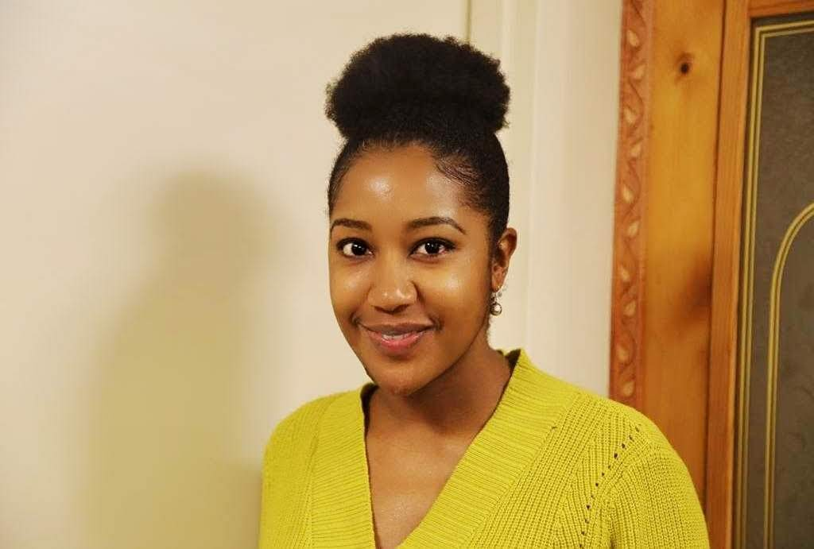

Created by Rehema Aida
My project name is personal-website
This is my first personal website and first project in Moringa School.
I used CSS to style my website
MIT licence was the option i preffered
Here is the link to my website https://rehema-aida.github.io/personal-website/
Below is my HTML code. Thank you

<!DOCTYPE html>
<html>
    <head>
        <title> REHEMA AIDA </title>
        <link href="css/styles.css" rel="stylesheet" type="text/css">
    </head>

    <body>
    

        

        
        <h1 class="name"> REHEMA AIDA </h1>
        <h2 class="position"> Web Developer </h2>
        

    

        <p1> I have worked in several organizations and in different fields, such as an.</p1>
        <li>Administrative Assistant</li>
        <li>Research Assistance</li>
        <li>Project Manager</li>
        <p2>Besides developing websites, I also have other interests in sports like, Tennis, Volley Ball and Basket ball.</p2>
        <p3> I own a Poultry Farm in Nakuru, where we supply eggs to local businesses. This is my second obsession besides computers.   Thank you for visiting my site. </p3>
        <p4> Check out my projects on <strong><em>Github</em></strong></p4>
        

    

      <ul>
        <li><a href=" https://rehema-aida.github.io/moosas-kitchen/">Moosa's Kitchen</a></li>
        <li><a href="https://rehema-aida.github.io/personal-website/">My Webebsite</a></li>
      </ul>
        

    </body>
</html>
